# STAR PLUS: astronaut health self-check

**NASA Space Apps Challenge 2026 · "Create Health Monitoring Software for Astronauts on Space Missions"**

STAR PLUS is an offline-first web app. Astronauts measure their own health indicators,
see a colour-coded status for each one with the reason and a cited source, and get
next steps. A flight surgeon or Mission Control sees the whole crew. Every screen works
without a network, because on a Mars transit the answer from Earth can be 8 to 44 minutes
away ([NASA NTRS 20250000703](https://ntrs.nasa.gov/citations/20250000703): up to 44 minutes
round trip). The same gap exists on Earth. Antarctic research stations hold about 5,000 people in
summer and 1,100 through the winter ([CIA World Factbook](https://www.cia.gov/the-world-factbook/about/archives/2022/countries/antarctica/)),
and about 2.57 million seafarers crew the world's merchant ships
([BIMCO/ICS Seafarer Workforce Report 2026](https://www.bimco.org/media/mxhbsjxb/seafarer-workforce-report-2026-executive-summary.pdf)).
They, and remote clinics, could use the same offline self-check with cited limits and next
steps while they wait for a doctor.

| | |
|---|---|
| **Live app** | https://starplus-frontend.vercel.app |
| **Try the demo** | Open `/login` and choose **Astronaut**, **Flight Medical Officer** or **Mission Control**. The card fills the demo login. Demo accounts hold **synthetic** data only. |
| **API (health check)** | https://starplus-backend.shareflow.workers.dev/api/health |
| **Frontend repo** | https://github.com/ariandesu/starplus-frontend (this repo, Next.js on Vercel) |
| **Backend repo** | https://github.com/ariandesu/starplus-backend (Cloudflare Worker, D1, R2) |

> **Not a medical device.** All data is synthetic, no clinician has reviewed the limits or
> texts, and NASA does not endorse this project. See [Disclosure](#supporting-documents).

## Team

| Member | Role |
|---|---|
| **Mahir Faisal** | Team lead, web developer and video editor |
| **Jotika Das** | Director and UI/UX designer |
| **Shatabdi Das** | Voiceover and researcher |
| **Shuvra Depta** | Researcher |
| **Saidur Ahrar Sristi** | Machine learning |

---

## Contents

1. [Screenshots of the live site](#1-screenshots-of-the-live-site)
2. [How it meets the challenge](#2-how-it-meets-the-challenge)
3. [Workflow diagrams](#3-workflow-diagrams)
4. [Datasets: where they came from and how they were made](#4-datasets-where-they-came-from-and-how-they-were-made)
5. [Supporting documents](#supporting-documents)
6. [Tech stack and repository map](#6-tech-stack-and-repository-map)
7. [Run it locally](#7-run-it-locally)
8. [Credits and licences](#8-credits-and-licences)

---

## 1. Screenshots of the live site

Captured from https://starplus-frontend.vercel.app on 2026-11-13, signed in with the demo
accounts. The values shown are synthetic.

| | |
|---|---|
| **Login: choose a mission role**<br>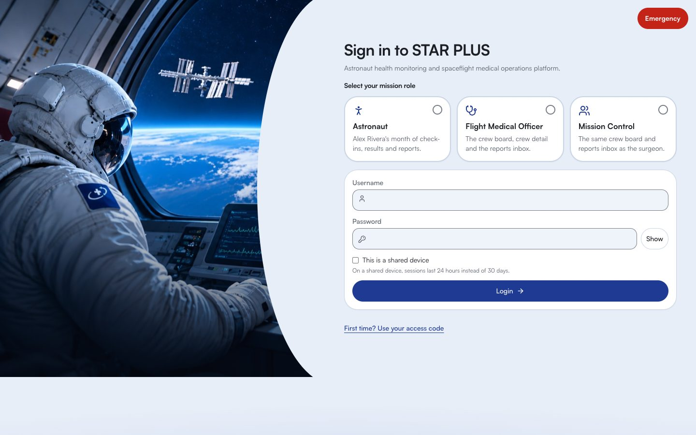 | **Today: overall status, measures to watch, readiness**<br>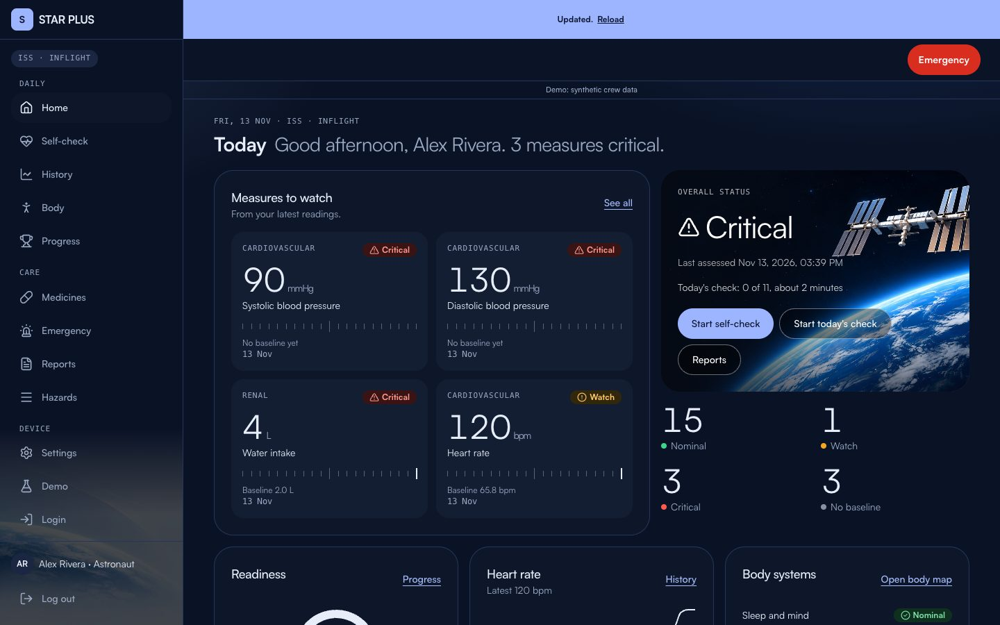 |
| **Self-check: mission tiles, XP and every input method**<br>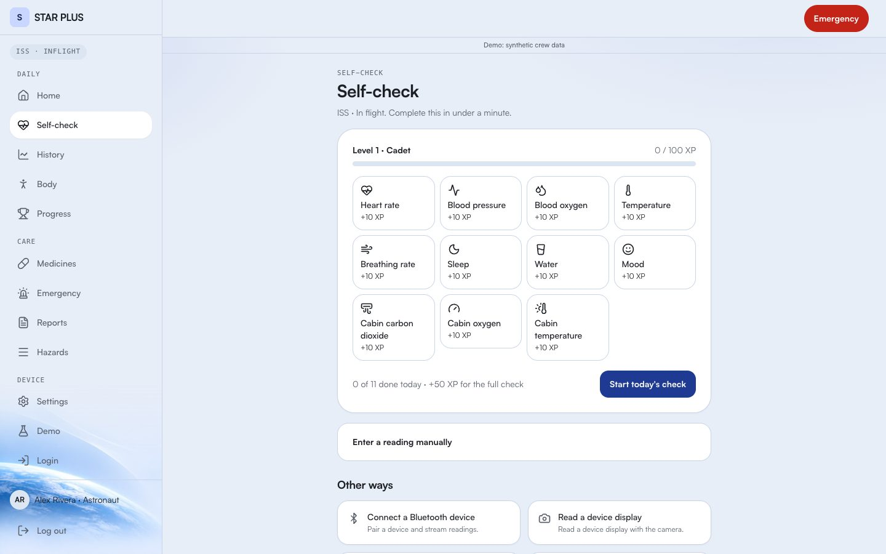 | **Today's check: one measure per screen**<br>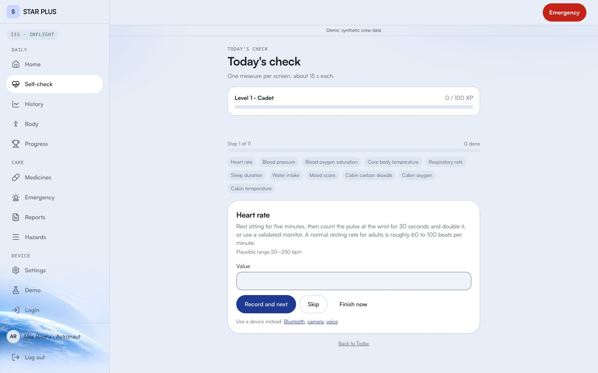 |
| **Body map: 3D figure, clickable systems with function and status**<br>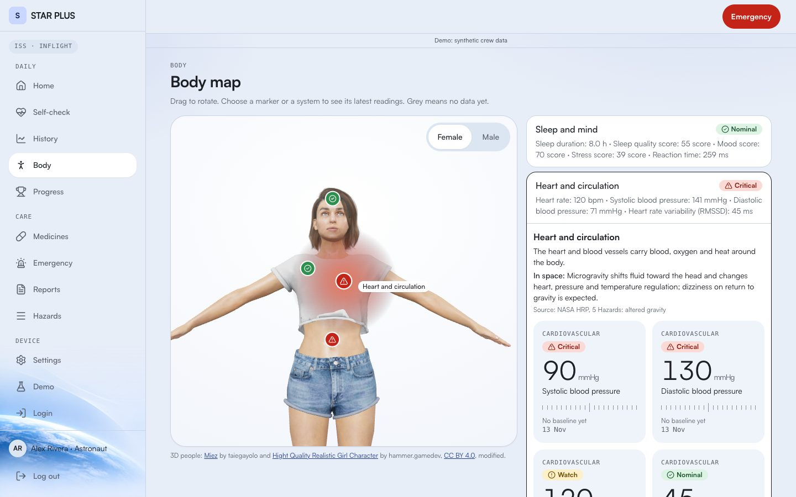 | **Hazards: the five NASA HRP hazards and what is tracked**<br>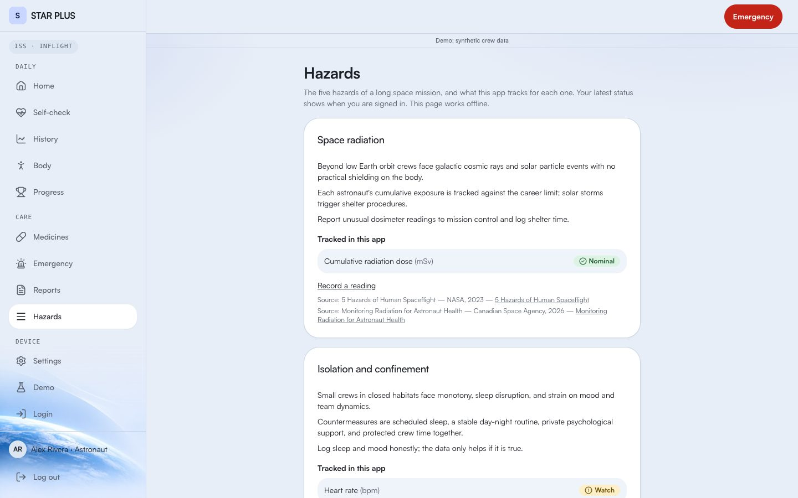 |
| **History: charts with the personal baseline band**<br>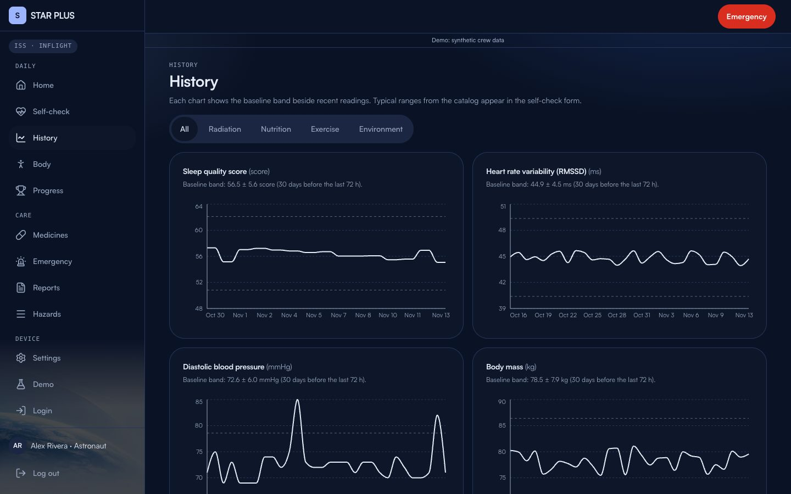 | **Result: status, cited source and "What to do"**<br>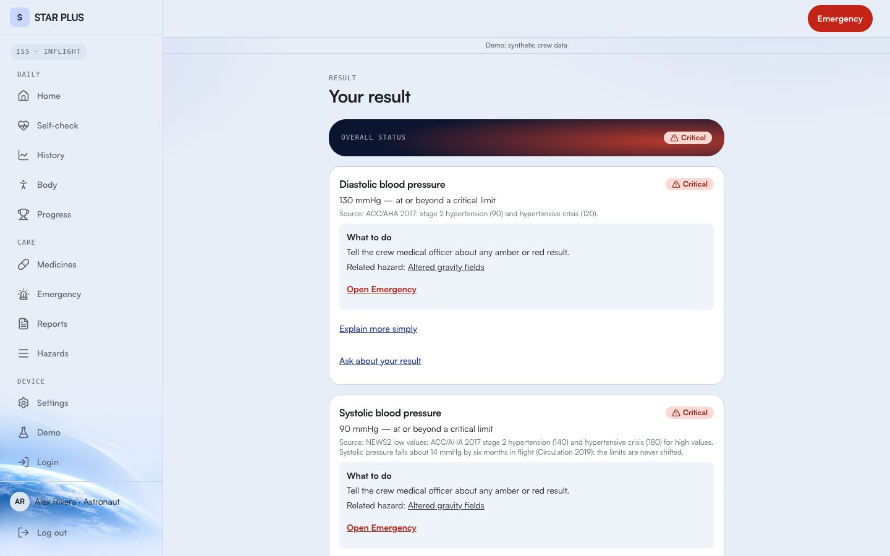 |
| **Progress: XP, ranks, streaks and mission patches**<br>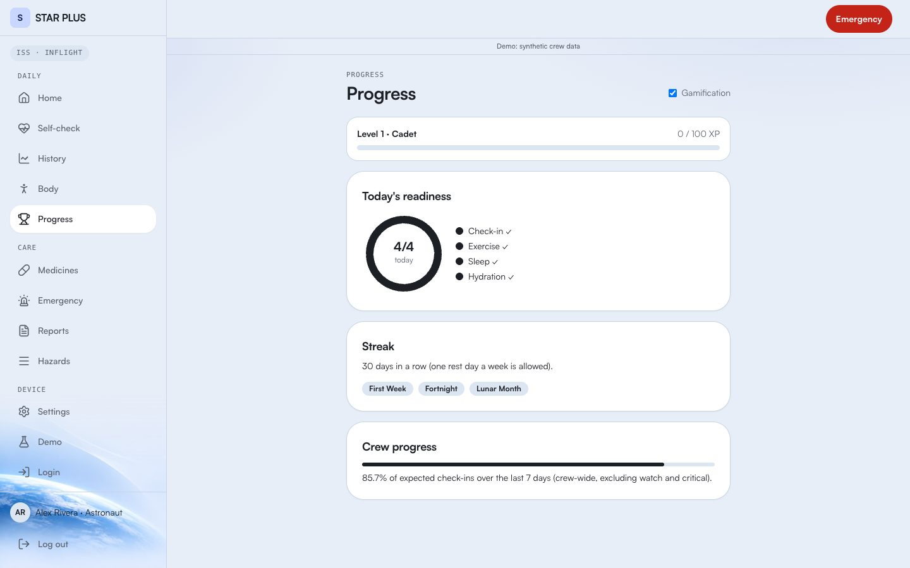 | **Medicines: onboard formulary with sources**<br>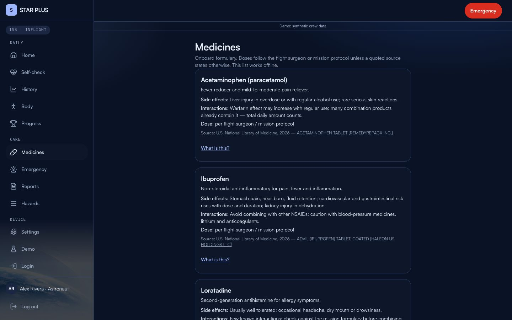 |
| **Emergency: no login, works offline**<br>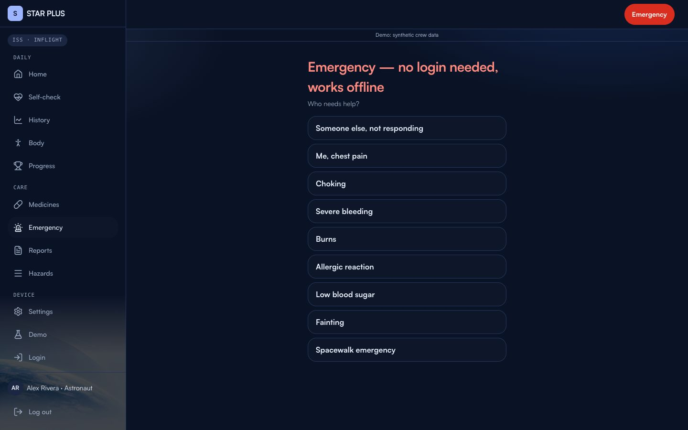 | **Flight surgeon: the crew board**<br>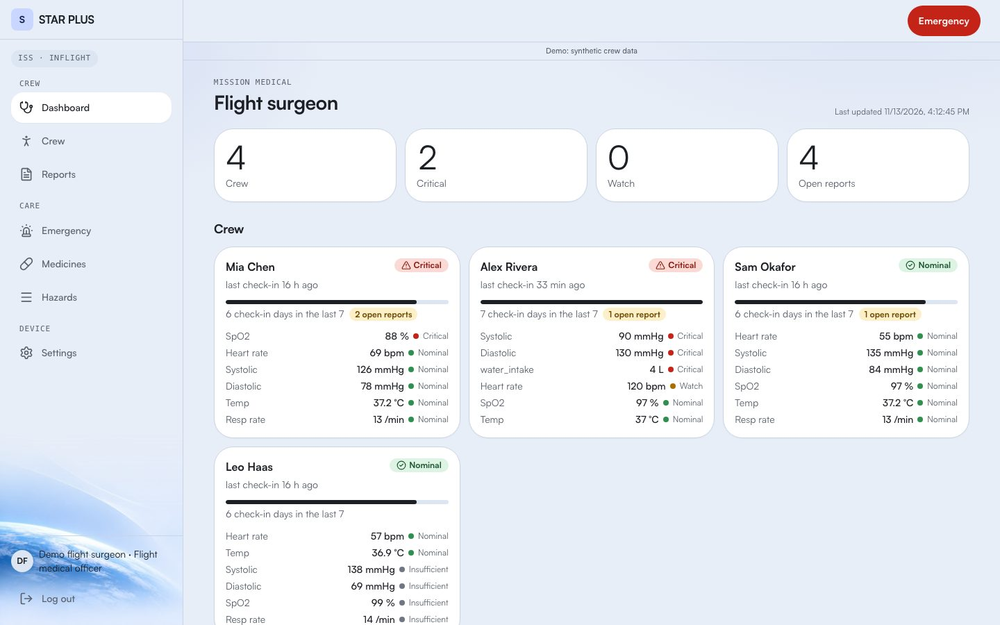 |
| **Settings: environment, phase, comms delay, theme**<br>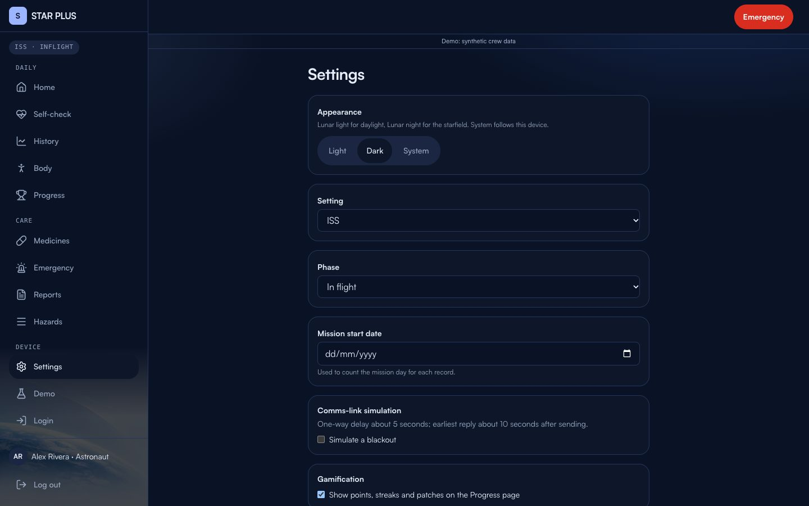 | **Flight surgeon: one crew member's detail**<br>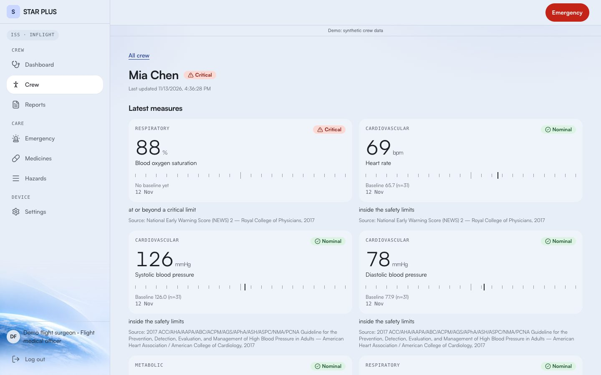 |
| **Phone: Today**<br>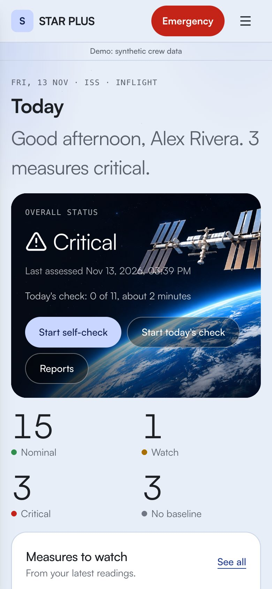 | **Phone: self-check**<br>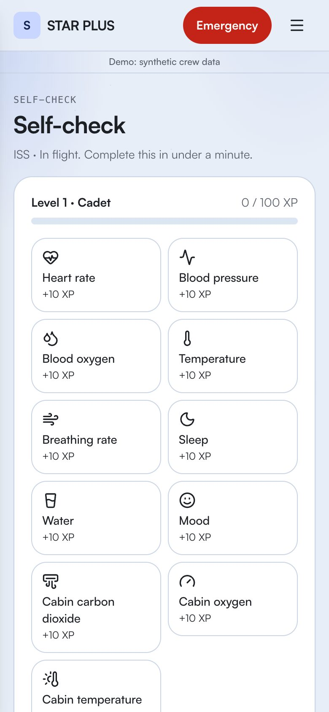 |

---

## 2. How it meets the challenge

| The challenge asks for… | STAR PLUS |
|---|---|
| Software that **gathers health indicators** | 22 measures, scored on the device: vital signs, sleep and mind, fuel and fluids, radiation dose and cabin air |
| The named indicators: **blood pressure, heart rate, blood sugar (mg/dL), body temperature, daily sleep hours, mood** | all six, each linked to the NASA hazard that affects it |
| **Any kind of input** (keyboard, mouse, camera images) | typing, a guided daily check, Bluetooth devices, **reading a device display with the camera**, **fingertip camera heart rate**, voice, a reaction test, a questionnaire, CSV and FHIR import |
| Astronauts **evaluate and act** on their health | status per measure (nominal, watch, critical, no baseline yet) from published safety limits plus a personal 30-day baseline. Each watch or critical result shows "What to do", the related hazard and, when critical, a link to Emergency. |
| **Guidance on treatments and health improvements** | an onboard formulary with sources (doses follow the flight surgeon or mission protocol), first-aid steps, hazard countermeasures, "Explain more simply", and a live "Ask about your result" answered from cited sources |
| Which measurements can be done in space, and **why** | every measure has a **How** text (device, posture, method) and a **Why** text (thresholds and who to tell) |
| How **spaceflight hazards** affect the indicators | the `/hazards` page lists the five NASA HRP hazards, what each does to the body, the countermeasures, and the measures tracked for each with their live status |
| When a result needs the **crew or flight surgeons** | watch and critical thresholds with sources (NEWS2, ACC/AHA, ADA, AASM, NASA-STD-3001); reports queue for the flight surgeon; a simulated comms delay and blackout |
| A **human figure** whose parts are clickable and show **function and health status** | `/body`: a 3D male or female figure with five clickable systems. Each shows what it does, why it matters in space, its status and the latest readings. |
| Different **environments** | ISS, Mars transit, Moon base, surface rover; pre-flight, in flight, surface, post-flight |
| **Prompts** for routine measurements | "Today's check": 11 steps with a progress count, a Home reminder and streaks |
| **Gamification** | XP for *completing* checks (never for the values), 6 ranks, streaks, mission patches, crew progress |
| **Dynamic charts** over time | `/history`, with the personal baseline band and filters; the glucose chart also shades the Inspiration4 crew range from NASA OSDR OSD-575 |
| **Colour coding** at a glance | green, amber, red and grey, always with an icon and a word |
| **Simple instructions and explanations** | How and Why texts, "Explain more simply" (reviewed, written at build time), and a labelled AI answer |
| Uses the **challenge resources** | NASA HRP *5 Hazards of Human Spaceflight* and *Risks of Human Spaceflight*, and CSA *Monitoring Radiation for Astronaut Health*, are cited in the knowledge base. Live NASA **DONKI** space-weather data feeds the radiation card. |

---

## 3. Workflow diagrams

### 3.1 System architecture

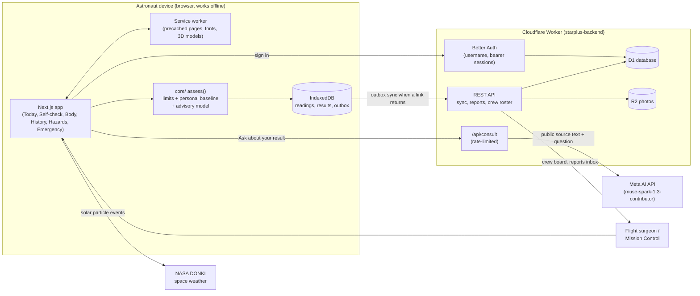
```mermaid
flowchart LR
  subgraph Device["Astronaut device (browser, works offline)"]
    UI["Next.js app<br/>(Today, Self-check, Body, History, Hazards, Emergency)"]
    SW["Service worker<br/>(precached pages, fonts, 3D models)"]
    IDB[("IndexedDB<br/>readings, results, outbox")]
    CORE["core/ assess()<br/>limits + personal baseline<br/>+ advisory model"]
    UI --> CORE --> IDB
    UI <--> SW
  end

  subgraph Cloud["Cloudflare Worker (starplus-backend)"]
    AUTH["Better Auth<br/>(username, bearer sessions)"]
    API["REST API<br/>sync, reports, crew roster"]
    CONSULT["/api/consult<br/>(rate-limited)"]
    D1[("D1 database")]
    R2[("R2 photos")]
    AUTH --> D1
    API --> D1
    API --> R2
  end

  IDB -- "outbox sync when a link returns" --> API
  UI -- "sign in" --> AUTH
  UI -- "Ask about your result" --> CONSULT
  CONSULT -- "public source text + question" --> META["Meta AI API<br/>(muse-spark-1.3-contributor)"]
  UI -- "solar particle events" --> DONKI["NASA DONKI<br/>space weather"]
  SURGEON["Flight surgeon /<br/>Mission Control"] --> UI
  API -- "crew board, reports inbox" --> SURGEON
```

### 3.2 One self-check, from measurement to the flight surgeon

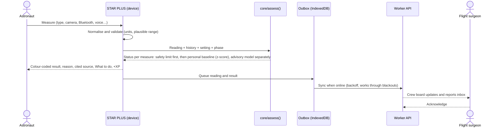
```mermaid
sequenceDiagram
  actor A as Astronaut
  participant App as STAR PLUS (device)
  participant Core as core/assess()
  participant Out as Outbox (IndexedDB)
  participant W as Worker API
  actor S as Flight surgeon
  A->>App: Measure (type, camera, Bluetooth, voice…)
  App->>App: Normalise and validate (units, plausible range)
  App->>Core: Reading + history + setting + phase
  Core-->>App: Status per measure: safety limit first, then personal baseline (z-score), advisory model separately
  App-->>A: Colour-coded result, reason, cited source, What to do, +XP
  App->>Out: Queue reading and result
  Out->>W: Sync when online (backoff, works through blackouts)
  W-->>S: Crew board updates and reports inbox
  S-->>W: Acknowledge
```

### 3.3 Datasets and content pipeline

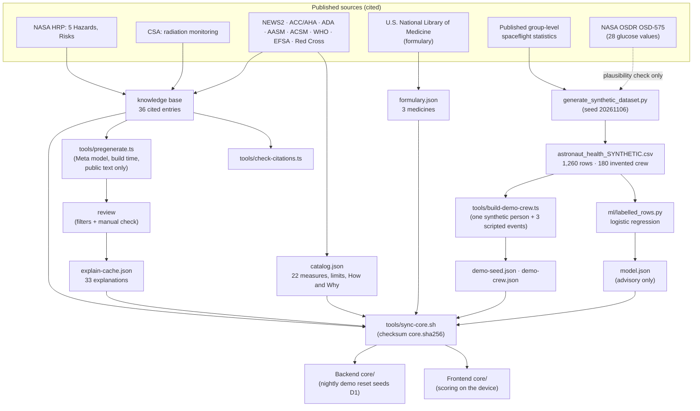
```mermaid
flowchart TB
  subgraph Sources["Published sources (cited)"]
    HRP["NASA HRP: 5 Hazards, Risks"]
    CSA["CSA: radiation monitoring"]
    CLIN["NEWS2 · ACC/AHA · ADA · AASM · ACSM · WHO · EFSA · Red Cross"]
    NLM["U.S. National Library of Medicine<br/>(formulary)"]
    STATS["Published group-level<br/>spaceflight statistics"]
    OSDR["NASA OSDR OSD-575<br/>(28 glucose values)"]
  end

  CLIN --> CAT["catalog.json<br/>22 measures, limits, How and Why"]
  HRP --> KB["knowledge base<br/>36 cited entries"]
  CSA --> KB
  CLIN --> KB
  NLM --> FORM["formulary.json<br/>3 medicines"]
  KB --> CHK["tools/check-citations.ts"]
  KB --> PRE["tools/pregenerate.ts<br/>(Meta model, build time,<br/>public text only)"]
  PRE --> REV["review<br/>(filters + manual check)"]
  REV --> EXPL["explain-cache.json<br/>33 explanations"]

  STATS --> GEN["generate_synthetic_dataset.py<br/>(seed 20261106)"]
  OSDR -. "plausibility check only" .-> GEN
  GEN --> CSV["astronaut_health_SYNTHETIC.csv<br/>1,260 rows · 180 invented crew"]
  CSV --> TRAIN["ml/labelled_rows.py<br/>logistic regression"]
  TRAIN --> MODEL["model.json<br/>(advisory only)"]
  CSV --> DEMO["tools/build-demo-crew.ts<br/>(one synthetic person + 3 scripted events)"]
  DEMO --> SEED["demo-seed.json · demo-crew.json"]

  CAT & KB & FORM & EXPL & MODEL & SEED --> SYNC["tools/sync-core.sh<br/>(checksum core.sha256)"]
  SYNC --> FE["Frontend core/<br/>(scoring on the device)"]
  SYNC --> BE["Backend core/<br/>(nightly demo reset seeds D1)"]
```

### 3.4 How the project was built

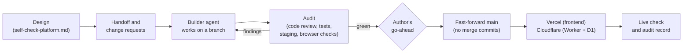
```mermaid
flowchart LR
  D["Design<br/>(self-check-platform.md)"] --> H["Handoff and<br/>change requests"]
  H --> B["Builder agent<br/>works on a branch"]
  B --> A["Audit<br/>(code review, tests,<br/>staging, browser checks)"]
  A -- "findings" --> B
  A -- "green" --> G{"Author's<br/>go-ahead"}
  G --> P["Fast-forward main<br/>(no merge commits)"]
  P --> V["Vercel (frontend)<br/>Cloudflare (Worker + D1)"]
  V --> L["Live check<br/>and audit record"]
```

---

## 4. Datasets: where they came from and how they were made

**No real astronaut data is used anywhere.** Individual astronaut medical records are
protected and held under controlled access (NASA LSDA/LSAH, TRISH EXPAND), so the project
uses synthetic data built from published statistics, and states so everywhere.

> **A note on the 240-second video.** The narration says the project uses "real research
> data from NASA's OSDR, including dataset OSD-575". To be precise: OSD-575 (serum glucose
> from the Inspiration4 crew) is used **only** as a plausibility reference for the synthetic
> ranges and as a shaded comparison band on the glucose history chart; no OSDR row is copied
> into the training data. The live NASA data in the app is **DONKI** space weather, shown on
> the Home radiation card.

| Dataset | How it was made | Where it is used |
|---|---|---|
| **`astronaut_health_SYNTHETIC.csv`** (backend `ml/data/`) | Generated by `generate_synthetic_dataset.py` (seed 20261106, byte-reproducible) from **published group-level statistics**: 180 invented astronauts (IDs `SYN-A001`…), 7 records each across mission phases (L-90, L-10, flight days 21/75/150, R+7, R+60), with phase effects applied and a sick/fit label drawn per record. The agency column is a random label. Full method: [`how_data_was_generated.txt`](https://github.com/ariandesu/starplus-backend/blob/main/ml/data/how_data_was_generated.txt). | trains the advisory model; source of the demo person |
| **NASA OSDR OSD-575** | 28 public serum-glucose values from 4 Inspiration4 crew members | **only** a plausibility reference for the synthetic ranges; no row is copied into the training data. In the app: named, with a link, next to the "Demo: synthetic crew data" banner, and drawn as a shaded reference band on the glucose history chart (mean ± 1 SD of the 24 samples without R+45: 69.4–91.7 mg/dL; values in `src/lib/osd575.ts`). The band never changes a status |
| **Advisory model** (`core/content/model.json`) | Logistic regression in `ml/labelled_rows.py`: for each person, the latest value and the z-score against their earlier rows, for 15 measures (30 features). Split by person: 5-fold grouped cross-validation and 20 % held-out people. Held-out accuracy ≈ 0.85, **on synthetic labels only**. See the [model card](https://github.com/ariandesu/starplus-backend/blob/main/ml/MODEL_CARD.md). | shown as a grey "Model view" panel; **never** changes a status or a next step |
| **Demo crew** (`core/content/demo-seed.json`, `demo-crew.json`) | `tools/build-demo-crew.ts` takes one synthetic person's rows (SYN-A001). It keeps volatile measures steady and scripts three events (two watch, one critical), so the demo shows every status. Four demo crew members, including Mia Chen (critical SpO₂), for the surgeon view. | the Worker reseeds the demo accounts every night |
| **Measure catalog** (`core/content/catalog.json`) | Hand-built from cited guidelines: 22 measures with units, plausible ranges, **safety limits with their source** (NEWS2, ACC/AHA 2017, ADA, AASM/SRS, ACSM, NASA-STD-3001 career limit), baseline settings and the related hazard | all scoring |
| **Knowledge base** (`core/content/kb/`, 36 entries) | Short How and Why texts and hazard texts, each with citations (NASA HRP, CSA, NEWS2, AHA/ACC, ADA, AASM, WHO, EFSA, Red Cross first aid and others), checked by `tools/check-citations.ts` | How and Why, the hazards page, first aid, Explain |
| **Explanations** (`core/content/explain-cache.json`, 33) | Written **at build time** by `tools/pregenerate.ts` from **public knowledge-base text only**, passed through safety filters (no new numbers, no doses, keep qualifiers), then reviewed | "Explain more simply" (offline) |
| **Formulary** (`core/content/formulary.json`, 3 medicines) | Purpose, side effects and interactions from the **U.S. National Library of Medicine**. The dose always reads "per flight surgeon / mission protocol". | the Medicines page |
| **Live space weather** | NASA **DONKI** solar-particle events for the last 30 days, fetched by the browser with a timeout and cached for a day; the app works without it | the Home radiation card, which always names the DONKI result: the event count (amber), "no solar particle events in the last 30 days", or that the feed loads when online |

Every stored reading carries a **`provenance`** of `real`, `synthetic` or
`simulated_device`. Synthetic and simulated readings earn no points and are left out of
crew progress.

---

## Supporting documents

| Document | What it covers |
|---|---|
| [Design: self-check platform](docs/design/self-check-platform.md) | the approved design: user journeys, scoring rules, safety limits with sources, the API, screens, risks |
| [Disclosure](https://github.com/ariandesu/starplus-backend/blob/main/docs/disclosure.md) | dated timeline, synthetic data, **who did what (people and AI tools)**, third-party assets, no clinical review |
| [Deviation log](https://github.com/ariandesu/starplus-backend/blob/main/docs/designs/deviations.md) | every place the build differs from the design, and why |
| [Model card](https://github.com/ariandesu/starplus-backend/blob/main/ml/MODEL_CARD.md) | the advisory model: data, method, evaluation, limits |
| [How the synthetic data was generated](https://github.com/ariandesu/starplus-backend/blob/main/ml/data/how_data_was_generated.txt) | why real data was not used, how each row was built |
| [Demo script](https://github.com/ariandesu/starplus-backend/blob/main/docs/demo-script.md) | a walk-through for judges |
| [Usability test](docs/usability-test.md) | an expert walkthrough of the live demo (2026-11-14, AI-assisted, not a user test) with its findings, and a 15-minute user-test kit: five tasks, the SUS questionnaire and a results table |
| [Build progress](https://github.com/ariandesu/starplus-backend/tree/main/docs/progress) | what each build phase delivered |
| [3D model credits](public/models/CREDITS.md) | sources, licences, checksums and changes for every 3D model and image |

---

## 6. Tech stack and repository map

*   **Frontend:**
    *   Next.js 16 (App Router) and React 19, TypeScript, Tailwind CSS 4;
    *   Serwist service worker; IndexedDB (`idb`);
    *   Recharts, three.js with a Draco decoder, and Tesseract.js (loaded only when used);
    *   Better Auth client;
    *   deployed on **Vercel** from `main`.
*   **Backend:**
    *   Cloudflare Worker with **D1** (SQLite) and **R2** (photos);
    *   Better Auth with username and bearer sessions;
    *   rate limits, and a nightly demo reset.
*   **Shared `core/`:**
    *   the scoring (`assess`), the catalog, the knowledge base, the formulary, the model
        and the explanations;
    *   kept in the backend and copied here by the backend's `tools/sync-core.sh`, with a checksum
        (`core/core.sha256`) checked by the tests.

```
src/app/          routes: login, Today (/), check (+ daily, bluetooth, camera, camera-hr, voice,
                  reaction, questionnaire), result, history, body, hazards, progress, medicines,
                  reports (+ fitness), emergency, surgeon (+ crew, reports), settings, demo
src/components/   app shell, body viewer, mission card, XP feedback, surgeon board, UI kit
src/lib/          session and auth, API and outbox sync, IndexedDB, daily plan, XP, adapters
core/             shared scoring and content (synced from the backend; not edited here)
test/             unit tests (Vitest);  test/e2e/  browser tests (Playwright: Chromium, WebKit)
docs/             design document and the screenshots above
```

---

## 7. Run it locally

```bash
npm ci
npm run dev                 # development server
npm run lint && npm run typecheck && npm test
npm run build               # production build (webpack; needed by the service worker)
```

Browser tests run against the staging API (`npm run build:staging`, then
`npx playwright test`). They need the staging demo password from the maintainers as
`NEXT_PUBLIC_DEMO_PASSWORD`.

---

## 8. Credits and licences

*   **This project:** open source under the **MIT License**, see [`LICENSE`](LICENSE).
    The third-party assets below keep their own licences.
*   **3D people:** "Miez" by taiegayolo and "Hight Quality Realistic Girl Character" by
    hammer.gamedev, from Sketchfab, **CC BY 4.0**, modified (rig removed, reduced, Draco
    compressed). Credited on the Body page.
*   **Space Shuttle model:** "Space Shuttle (D)" with its engine and bay-door parts, from
    NASA 3D Resources, NASA, free and without copyright, used unmodified. The NASA insignia
    on the model is part of NASA's own model; **NASA does not endorse this project.**
*   **Draco decoder:** Google, Apache-2.0, shipped with three.js.
*   **Font:** Satoshi (Fontshare free licence), self-hosted.
*   **Dashboard and login images:** AI-generated illustrations supplied by the author; not
    photographs of real missions.
*   **AI use:** the disclosure lists every AI tool and what it did: design and audit
    (Claude), code (Muse Code, Command Code), build-time explanations and the live
    "Ask" answers (Meta `muse-spark-1.3-contributor`).
